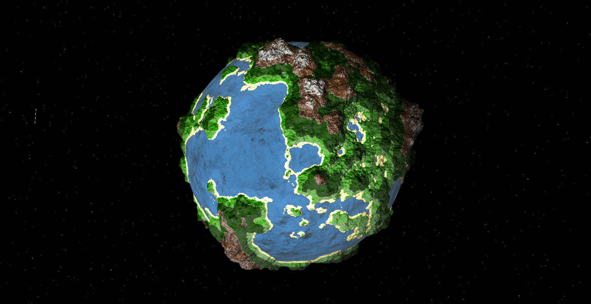
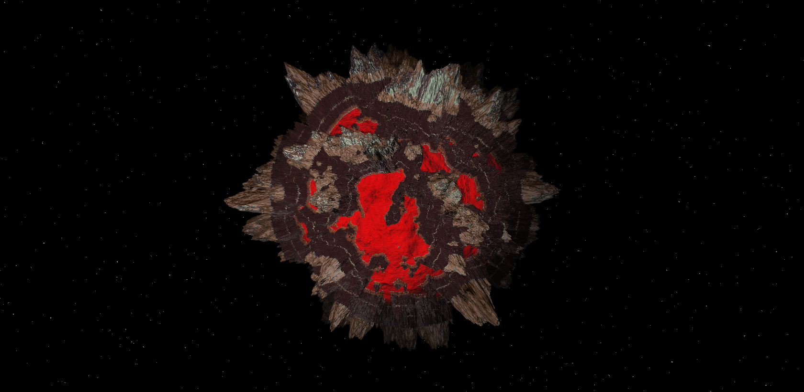
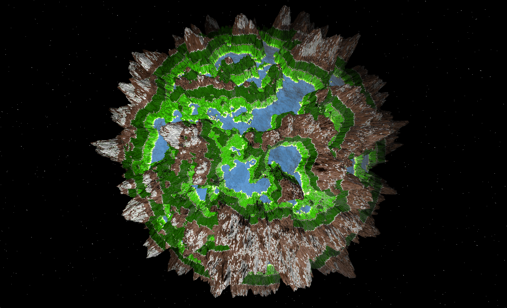
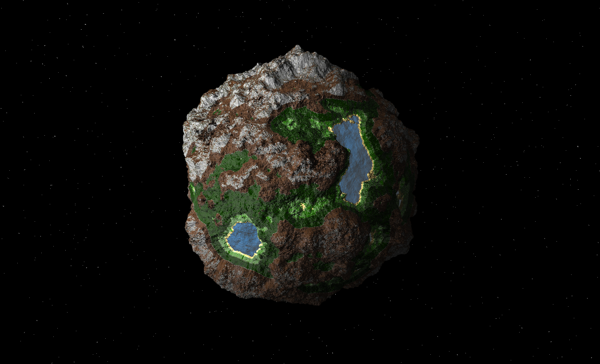
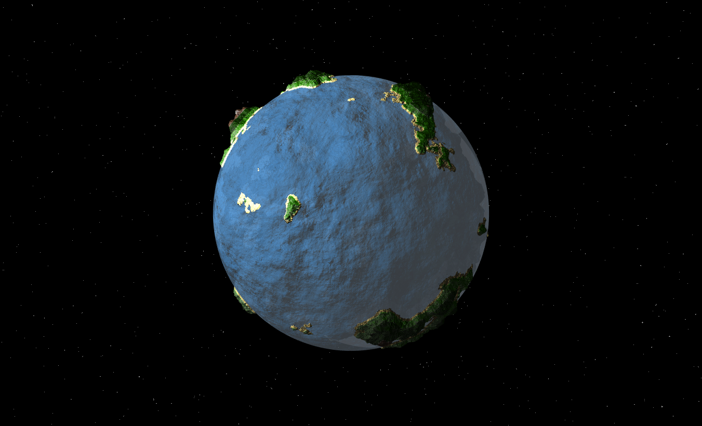
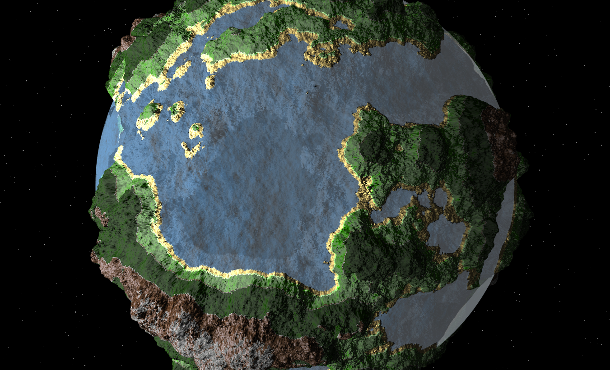
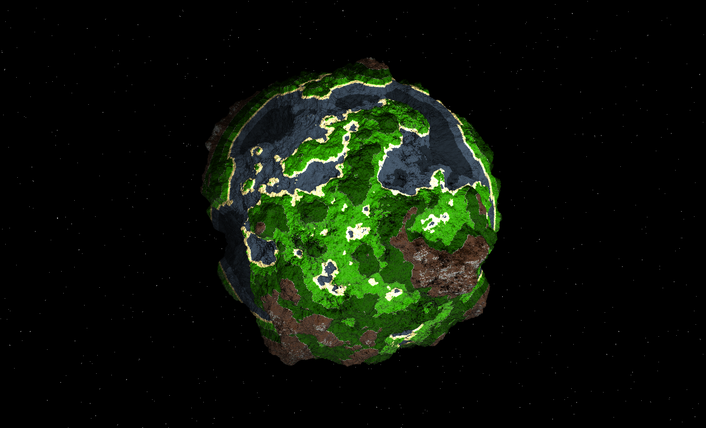

# CIS 566 Project 1: Noisy Planets

### By Vasu Mahesh

### Overview

I used most of the information from the Implicit Procedural Planet [paper](https://static1.squarespace.com/static/58a1bc3c3e00be6bfe6c228c/t/58a4d25146c3c4233fb15cc2/1487196929690/ImplicitProceduralPlanetGeneration-Report.pdf) and some help from [Inigo Quillez](http://www.iquilezles.org/www/index.htm) 's blog. 

### Surface Normals

I used IQ's Analytical Derivative article to generate noise. AD method seems to be effective at giving me the surface derivates along with the noise in the same package. I combine this noise in an FBM to generate my terrain. More information can be found [here](http://www.iquilezles.org/www/articles/morenoise/morenoise.htm)

The GUI also provides a way to scale the noise. So we can get stuff like tiny islands. Also, we can change the elevation of the terrain.

### Water Level

### Ocean Depth

I render my water in a second draw call. This allows me to give water some opacity and blending. If you look closely in this image, you can see the terrain underneath the water. Because of this, I don't have a color for "deep ocean". It just comes automatically by setting the right opacity and the right color of the terrain underneath.

### LOD

Implemented LOD feature as described in the [paper](https://static1.squarespace.com/static/58a1bc3c3e00be6bfe6c228c/t/58a4d25146c3c4233fb15cc2/1487196929690/ImplicitProceduralPlanetGeneration-Report.pdf). By using the distance as an input, I change the octaves to render in my noise.

### Colors

I used matcap to get terrain colors. Some colors are still a single hex value, I felt matcap gave a way more cooler look to it that just flat colors.

## Useful Links
- [Analytical Derivatives in Noise](http://www.iquilezles.org/www/articles/morenoise/morenoise.htm)
- [Implicit Procedural Planet Generation](https://static1.squarespace.com/static/58a1bc3c3e00be6bfe6c228c/t/58a4d25146c3c4233fb15cc2/1487196929690/ImplicitProceduralPlanetGeneration-Report.pdf)
- [Curl Noise](https://petewerner.blogspot.com/2015/02/intro-to-curl-noise.html)
- [GPU Gems Chapter on Perlin Noise](http://developer.download.nvidia.com/books/HTML/gpugems/gpugems_ch05.html)
- [Worley Noise Implementations](https://thebookofshaders.com/12/)
